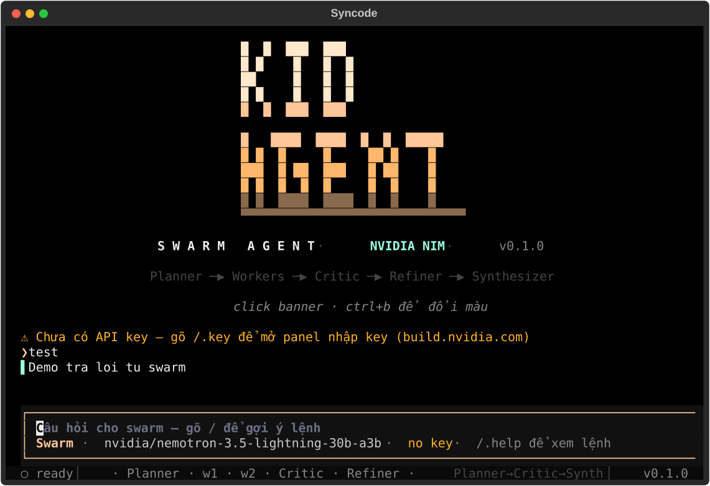

# Syncode / Kidagent (tên cũ)

**CLI Swarm Agent** chạy trên **NVIDIA NIM** — mỗi câu hỏi được một pipeline
multi-agent xử lý nối tiếp: `Planner → Workers → Critic → (Refiner) → Judge`
để cho ra đáp án hoàn thiện nhất, ngay trong terminal.



## Tính năng

- **Swarm song song** — Planner tách việc (JSON), workers chạy đồng thời theo
  chuyên môn coder / reviewer / researcher, Critic chấm APPROVED/REVISE,
  Judge chốt đáp án gọn, đúng trọng tâm.
- **TUI full-screen** (textual) — chat tối giản, panel hoạt động tự thu gọn,
  panel **Thinking** tách riêng reasoning của model, footer trạng thái live.
- **Tools + MCP** — 14 tool builtin (đọc/sửa file, shell, web, hỏi user…),
  cắm thêm server MCP bất kỳ. 2 mode: `plan` (chỉ đọc) / `build` (full).
- **Model linh hoạt** — mọi model chat trên NIM catalog, đặt model riêng cho
  từng role (`planner`, `worker`, `w1/w2`, `critic`, `refiner`, `judge`).
- **Nhớ phiên** — lịch sử theo session trong `~/.syncode/history.json`,
  `/.compact` gom lượt cũ thành tóm tắt khi context đầy.
- **Vệ sinh output** — reasoning lạc kênh, echo Q&A, tường thuật quy trình đều
  bị lọc; `/.debug` cho xem chẩn đoán lượt gọi cuối.

## Cài đặt

```bash
# 1 lenh (moi may): tai ban release tu GitHub + cai vao Python hien tai
curl -sSL https://raw.githubusercontent.com/Ryothecoder/syncode/main/install.sh | bash
```

Hoặc cài từ source:

```bash
git clone https://github.com/Ryothecoder/syncode.git
cd syncode
pip install -e .
```

Cần Python ≥ 3.9. Lấy API key miễn phí tại
[build.nvidia.com](https://build.nvidia.com).

## Chạy ngay

```bash
export NVIDIA_API_KEY="nvapi-..."   # hoặc vào app gõ /.key nvapi-...
syncode                             # TUI full-screen
syncode --task "Giải thích transformer trong 5 bullet"   # one-shot
syncode --plain                     # REPL dòng lệnh đơn giản
```

Đổi model bất kỳ lúc nào: `/.model` (46 model gợi ý sẵn), model riêng cho role:
`/.model worker mistralai/mistral-7b-instruct-v0.3`, xem bảng đang dùng: `/.model`

## Lệnh `/.`

| Lệnh | Ý nghĩa |
|---|---|
| `/.help` | Danh sách lệnh |
| `/.config [show\|set <k> <v>\|reset]` | Xem/sửa config |
| `/.model [role] [name]` | Xem/đổi model (chung hoặc từng role) |
| `/.key <NVIDIA_API_KEY>` | Lưu API key |
| `/.tools`, `/.mcp`, `/.skills` | Xem tools / MCP / skills đã nạp |
| `/.mode [plan\|build]` | Chế độ chỉ-đọc / full |
| `/.swarm` | Bật/tắt swarm (tắt = trả lời nhanh) |
| `/.thinking [off\|low\|auto]` | Chế độ thinking của model |
| `/.todo [add\|done\|clear]` | Checklist theo session |
| `/.history`, `/.save [file]` | Xem / xuất lịch sử ra markdown |
| `/.compact` | Gom lượt cũ thành tóm tắt, nhẹ context |
| `/.debug`, `/.usage` | Chẩn đoán call cuối / token đã dùng |
| `/.undo` | Hoàn tác sửa file ở lượt gần nhất |
| `/.init [file]` | Tạo mẫu `AGENTS.md` cho repo |
| `/.clear`, `/.exit` | Xoá màn hình / thoát |

## Kiến trúc

```
 câu hỏi
   │  (câu chào → trả lời nhanh 1 lượt, bỏ qua swarm)
   ▼
 Planner ── tách ≤5 subtask (JSON, gắn chuyên môn)
   ▼
 Workers ── chạy song song, gọi tools khi cần
   ▼
 Critic ── APPROVED → Judge · REVISE → Refiner sửa → Judge
   ▼
 Judge ─── chốt đáp án cuối (stream ra terminal)
```

Skills (`.skills/`) và quy ước (`AGENTS.md`) tự nạp vào prompt.
Chi tiết xem [`CONTRIBUTING.md`](CONTRIBUTING.md).

## Cấu trúc

```
syncode/
├── cli.py              # entry point, REPL, wiring UI↔swarm
├── config.py           # ~/.syncode/config.json
├── llm/client.py       # NVIDIA NIM client (OpenAI-compatible, streaming)
├── swarm/              # agent.py · roles.py · orchestrator.py
├── tools/              # registry tool builtin + MCP
├── ui/                 # TUI textual + console rich
└── commands/           # slash commands
tests/                  # pytest, ~150 cases
```

## Test

```bash
pip install -e ".[dev]"
pytest -q
```

## Ghi chú
> Mã nguồn được **viết với sự hỗ trợ của AI** (mô hình ngôn ngữ lớn) và do con người rà soát, kiểm thử trước khi phát hành (~150 test cases, `pytest -q`).
> Nếu gặp lỗi hoặc hành vi lạ, mở issue kèm output của `/.debug`.

## License

MIT — xem [`LICENSE`](LICENSE).
